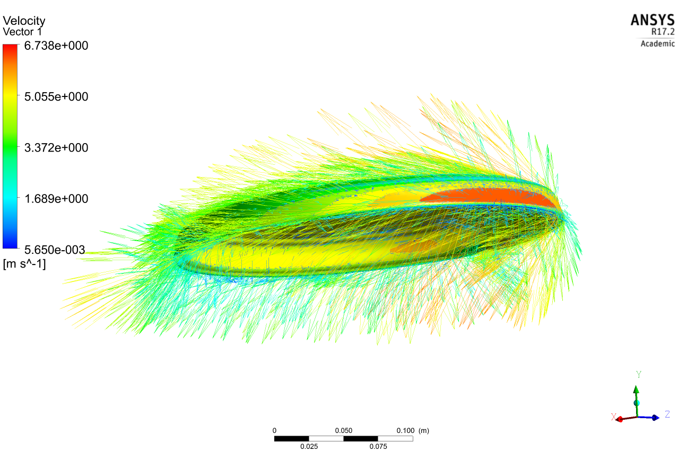
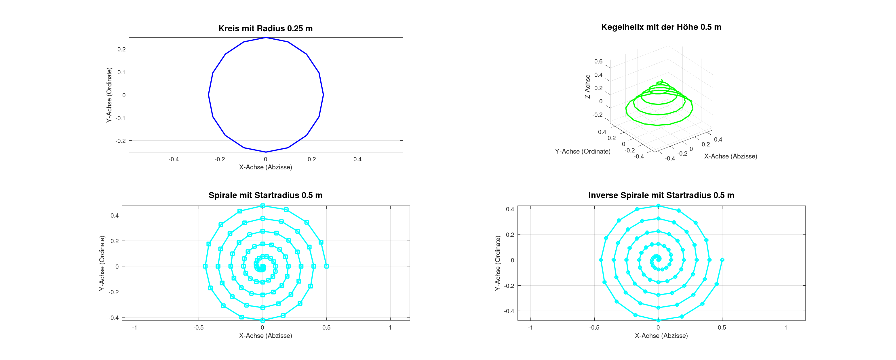
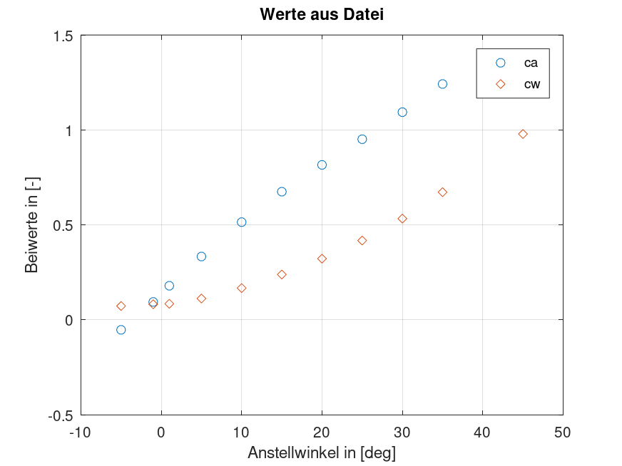
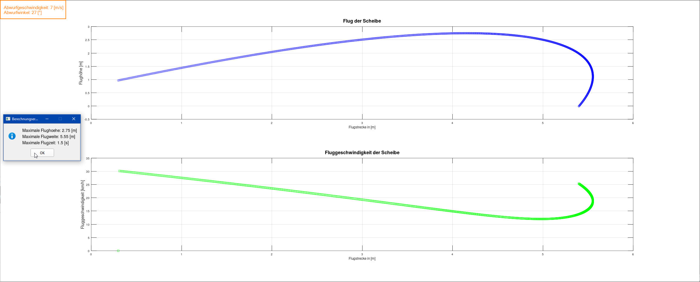

# Tutorium-Ultimate-Frisbee 🥏
Example Scripts and Data from tutorial sessions at TU Clausthal, showing the usage of polynomials to fit data points.


---


---

## Quick links
* [Overview](#overview)
* [Requirements](#requirements)
* [Get the files and data](#get-the-files-and-data)
* [Usage of the files](#usage-of-the-files)

## Overview
This demonstration is primarily focused on the usage of a machine that is using Windows as an OS.

For this example from the tutorial ANSYS 17.2 was used to calculate the lift and drag coefficients of a simplified EURODISC.
To reduce the complexity the rotation of the disk was not modeled in the simulation and the calculation for the flight distance is also croase estimation.

* Additional information is given by the set of slides [**04p2_UebungIWSW_ProfTutor**](04p2_UebungIWSW_ProfTutor.pdf)
    * **Hint:** use the desktop application _Adobe Acrobat Reader_ to be able to utilize all functionalities provided by the slides
        * [Adobe Acrobat Reader](https://get.adobe.com/de/reader/)

## Requirements
* An installation of Windows OS
    * Windows 10 or greater
* An optional installation of Git
    * [Git](https://git-scm.com/downloads)
* An intallation of GNU Octave (recommended)
    * [GNU Octave](https://octave.org/)
* Or an installation of Matlab
    * [Matlab](https://www.mathworks.com/products/matlab.html)
* Minimum available Disk space of 3 GB

## Get the files and data
This guide will show different ways that can be used to retrieve the necessary data from GitHub.

#### Clone the repository
The utilization of Git is the most comfortable way to transfer the data of the repository to the recommended default location.
* On a system using Windows, the following expression can be used to clone the repository
    * Command Line Shell (CMD)
        ```
        git clone https://github.com/RobertLicht/Tutorium-Ultimate-Frisbee.git %PUBLIC%\Tutorium-Ultimate-Frisbee
        ```
    * Git Bash Shell
        ```
        git clone https://github.com/RobertLicht/Tutorium-Ultimate-Frisbee.git /c/Users/Public/Tutorium-Ultimate-Frisbee
        ```

#### Download the repository
As an alternative to Git, the data of the repository can be downloaded as an archive (ZIP) to the local machine of the user.
* Use the URL to [download the repository](https://github.com/RobertLicht/Tutorium-Ultimate-Frisbee/archive/refs/heads/main.zip):
    * https://github.com/RobertLicht/Tutorium-Ultimate-Frisbee/archive/refs/heads/main.zip
* Extract the downloaded archive into the recommended default location:
    * Windows
        > %PUBLIC%\Tutorium-Ultimate-Frisbee\
    * Linux
        > /c/Users/Public/Tutorium-Ultimate-Frisbee/

## Usage of the files
This repository contains two relevant files, which can be executed directly.
* Navigate to the respective file and run it in _GNU Octave_ or _Matlab_

### Uebung03A2p1
This file shows some basic functionalities and will prompt the user to enter numeric values in the command line.
* Example figure
* 

### loadAndshow
This file will prompt the user to get the relevant data or inputs to continue with its calculations:
* Select a file, which contains the relevant values for the lift and drag coefficients of a simplified EURODISC
    * In this examle navigate and select the file _**UltimateDisc.xlsx**_
* Select a worksheet from the Workbook _UltimateDisc_
    * Worksheet 2: lift and drag coefficients calculated for a velocity of 5 [m/s]
    * Worksheet 3: lift and drag coefficients calculated for a velocity of 7 [m/s]
        * Example figure
        * 

* Enter the degree of the polynomial to fit the data points of the lift and drag coefficients
    * In this example a 6th degree polynomial has to be used
* Enter an ejection speed, that corresponds to the prior selected worksheet
* Enter a throwing angle from the range of allowed values
* In one of the last steps a croase flight simulation of the disc will be shown, followed by a figure showing information regarding the speed and height
    * Example figure
    * 
